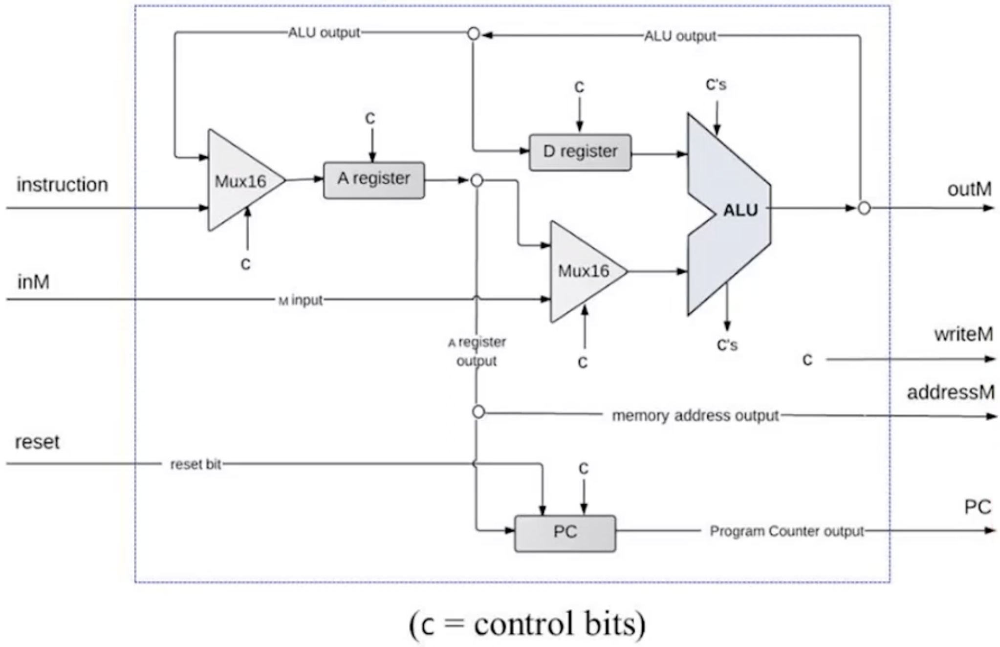
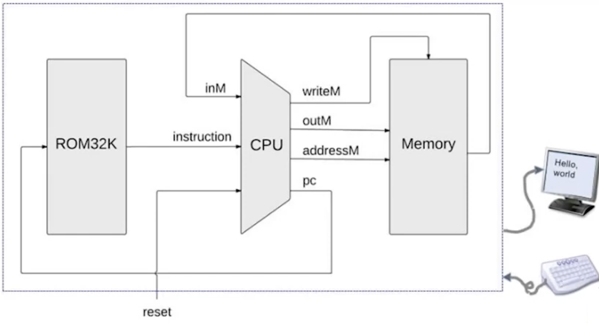

# Project 5 Notes

## Memory

The memory has 3 parts:

* **`RAM16K`** - The RAM that consists of 16384 registers.
* **`Screen`** - A 256 x 512 screen implemented using 8192 registers where each register makes up 16 pixels. The first register represents the first 16 pixels of the first row, the second register represents the second set of 16 pixels in the first row, and so on. Each row is represented using 512 / 16 = 32 registers.
* **`Keyboard`** - This is a single register that stores the screen code of the key currently pressed. If there is no key pressed, the registers stores 0.

**Key insights**

* If the address represents data in the `RAM16K`, then the first $log_2 (16384) = 14$ bits are used to represent the address. The 15th (most significant bit/MSB) is 0.
* If the address represents an address in the `Screen`, the MSB is 1, and the lower 13 bits range from 000...000 to 111...111 while the 14th bit remains 0 since there are only $log_2 (8192) = 13$ possibilities.
* If the address is that of the `Keyboard` register ($24576_10 = 110000000000000_2$). The 2 most significant bits are 1s while the rest are 0s.

**Practical Implications**

I used a `DMux` to route the `load` bit to the `RAM` based on the 15th bit, if it is 0, then `loadRAM = 1`. Otherwise the `DMux` routes the `load` bit to the screen or the keyboard (`loadScreenOrKBD`). To determine whether to route the `loadScreenOrKBD` bit to the screen or the keyboard, the DMux uses the 14th bit (if it is 1, `loadKBD = loadScreenOrKBD`, otherwise, `loadScreen = loadScreenOrKBD`).

Each component receives its respective `load` bit, and I used a `Mux16` to select between the `Screen` and `Keyboard` output since the 14th bits of their addresses are guaranteed to differ. Another `Mux16` is used to select between the previously selected output and the `RAM16K` output since the 15th bit (MSB) of its addresses differs from that of the addresses of the `Screen` and `Keyboard`.

## CPU

The CPU processes an instruction by decoding it, performing a calculation using the `ALU`, updating the `PC` as required, and outputting the results.

**Decoding**

The CPU initially decodes whether the instruction is an `A` or `C` instruction using the most significant bit of the instruction (the MSB of an `A` instruction is 0, but 1 for a `C` instruction). 

* An `A` instruction loads a 15 bit constant to the A register (the 16th bit is 0 by design of the A instruction).
* A `C` instruction encodes a computation.

**Setting the A Register**

* A `Mux` is used to decide the input to the `A` register. The instruction is the input if it is an `A` instruction, otherwise, the input is the output of the `ALU`.
* This input is loaded into the `A` register if it is the `A` instruction, or if the current `C` instruction specifies the `A` register as one of the destination registers for the output of the `ALU` (this is decided using the 6th bit of the `C` instruction).
* Therefore, we set the control bit to the `A` register to `AInstruction` $+$ `CInstruction` $\cdot$ `instruction[5]`
* Since the first 15 bits of the `A` register specifies the address of the selected register in memory, `addressM` is set to these 15 bits.

**`ALU`**

* A `C` instruction encodes the inputs using the 13th bit. The `D` register is always one of the inputs and the second input is the `A` register if the 13th bit is set to 0, otherwise, the second input is the `M` register (`inM`). This is implemented using a `Mux`.
* The 6 control bits (7th to 12th bits - `instruction[6]` through `instruction[11]`) that specify the computation are passed to the `ALU` along with the `inputs` and the result is stored in `outM`.

**Storing the output of the `ALU`**
The destination registers are specified using the 4th to the 6th bits.

* The 4th bit (`instruction[3]`) decides whether to save the results to memory (`Memory[A]`), therefore it is stored in `writeM`
* The 5th bit (`instruction[4]`) decides whether to save the results to the `D` register, so it is passed as a `load` bit to the `D` register.
* The 6th bit (`instruction[5]`) decides whether to save the results to the `A` register, this is discussed above when setting the `A` register.

If the instruction is an `A` instruction, it is parsed the same way a `C` instruction is parsed, and a calculation is performed. However, all destination and jump bits are ANDed with `CInstruction` before being used, so an A instruction never writes to the `D` register, the memory, or triggers a jump, even though the ALU still computes a result.

**Jump Logic (Updating the PC)**

The jump bits (the 3 least bits - instruction[2..0]) specify the condition under which the CPU should jump to the address stored in the A register instead of incrementing the PC.

* The 1st bit (`instruction[0]`) decides whether to jump if the ALU output is positive (`ng = 0 `and `zr = 0`).
* The 2nd bit (`instruction[1]`) decides whether to jump if the ALU output is zero (`zr = 1`).
* The 3rd bit (`instruction[2]`) decides whether to jump if the ALU output is negative (`ng = 1`).

Each bit is ANDed with its corresponding ALU flag, and the results are ORed together to produce a single jump signal. This is further ANDed with `CInstruction` to prevent `A` instructions from triggering jumps. If `jump = 1`, the PC loads the address from the `A` register. Otherwise, the PC increments. If `reset = 1`, the PC is set to 0 regardless.

## Computer

The `Computer` wires everything together (the memory, ROM (instruction memory), and the CPU).

**Workflow**:
* The `PC` in the `CPU` is used to fetch the next instruction from the `ROM32K` (a built-in chip used for its GUI side-effect, though can be implemented using 2 x `RAM16K`)
* The `instruction` the ROM outputs is passed to the `CPU` along with `inM`, received from the `Memory` chip, and a `reset` bit indicating whether the `PC` should be set to 0, or continue the program
* The `CPU` processes the instruction, performing a calculation using the `ALU`, and conditionally stores the output in the `A` and `D` registers.
* The CPU outputs the results of the `ALU` (`outM`), the address specified by the `A` register (`addressM`), whether to write the results of the `ALU` to the `Memory` (`writeM`), and the updated `PC`
* Finally, the `Memory` receives `outM`, `addressM`, and `writeM`. The `Memory` writes the `outM` to `addressM`, if `writeM` is set to 1. It also outputs the value of the register at `addressM` and feeds it back to the `CPU` for the next cycle
